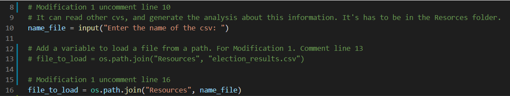

# Election_Analysis
Module 3 Bootcamp Python

## Proyect Overview
A Colorado Board of Elections employee has given me the following task to complete the election audit of a recent local congressional election. The purpose of this audit is to verify the numbers with the official counting, define how many voters registered for each county, who is the candidate who won in the popular vote and even we can get the result for each county.

1. Calculate the total number of votes cast.
2. Get a complete list of candidates who received votes.
3. Calculate the total number of votes each candidate received.
4. Calculate the percentage of votes each candidate won.
5. Determine the winner of the election based on popular vote.
6. The voter turnout for each county
7. The percentage of votes from each county out of the total count
8. The county with the highest turnout

## Resorces
- Data source: election_results.cvs
- Software: Python 3.8.8, Visual Studio Code, 1.57.1

## Summary
The analysis of the election show that:
  - There were 369,711 votes cast in the election
  - The countries that participated in the election:
      - Jefferson
      - Denver
      - Arapahoe
  - The voter turnout for each county:
      - Jefferson had 10.5% of the vote with 38,855.
      - Denver had 82.8% of the vote with 306,055.
      - Arapahoe had 6.7% of the vote with 24,801.
  - The county with the highest turnout
      - Denver had 82.8% of the vote with 306,055.
  - The candidates were:
      - Charles Casper Stockham
      - Diana DeGette
      - Raymon Anthony Doane
  - The candidate result were:
      - Charles Casper Stockham received 23.0% of the vote and 85,213 number of votes.
      - Diana DeGette received 73.8% of the vote and 272,892 number of votes.
      - Raymon Anthony Doane received 3.1% of the vote and 11,606 number of votes.
  - The winner of the election was:
      - Diana DeGette received 73.8% of the vote and 272,892 number of votes

## Challange Overview
The election commission has requested some additional data to complete the audit:

1. The voter turnout for each county
2. The percentage of votes from each county out of the total count
3. The county with the highest turnout

## Challange Summary
Give at least two examples of how this script can be modified to be used for other elections.

This code can be used for other elections: 

### Modification 1 
It can read another ".csv" file. In this case, works if the file is in the folder Resources, the program will ask for the name of the file, please type "election_results_demo.csv" and the program will read and make the operations that we wrote before.
I added an input function for asking the name of the csv file, once you give the name, this value is saved in a variable name_file that is used to get the path and then the program will execute the actions and give a result (Line 10 and 15)

get the result for county, input the county we need.